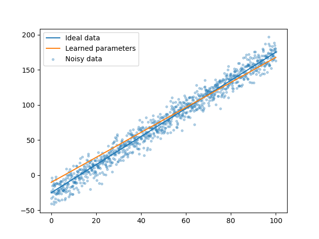
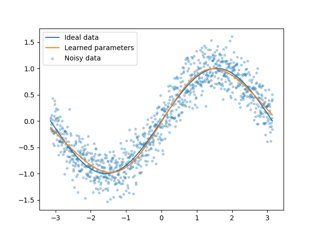

# Regression tutorial

## Description

In this first session, we will cover how to solve regression problems using neural networks.
This section contains three examples:
* Linear regression in Python, to understand how partial derivatives are used to update the weights;
* Linear regression in PyTorch with a single neuron, to get familiar with the library;
* General regression in PyTorch using multiple layers and non-linear activation function, the general regression architecture.

  
  

## Recommended reading material
