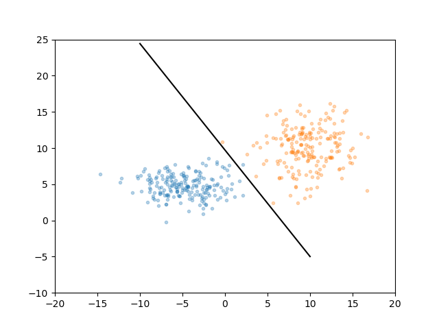
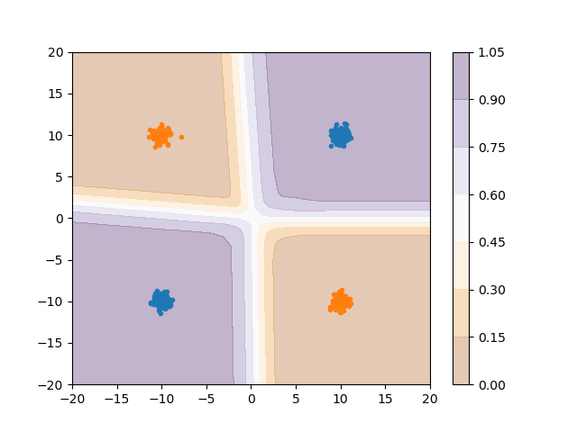
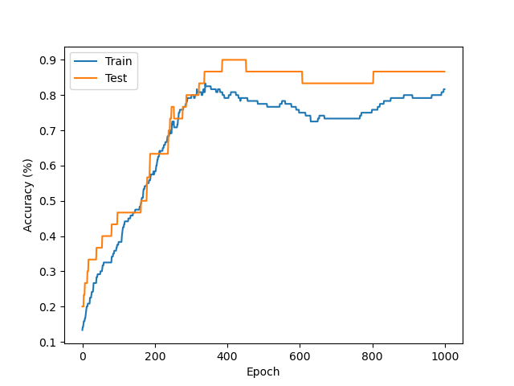

# Classification tutorial

## Description

In this second section, we move to solving classification problems using neural networks. This section contains 4 examples:
* The Rosenblatt's perceptron, the historical case to distinguish between two classes
* Linear classification in PyTorch without non-linear activation, to draw a linear boundary between two classes
* General classification in PyTorch, solving the XOR problem using multiple layers and non-linear activation
* A "realistic" work case on the Iris dataset, introducing some classic data processing techniques

  
  
  

## Recommended reading material
